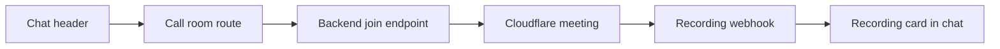

# CareNestPro Web Docs

This folder holds the web docs for the RealtimeKit call and recording flow.

## Required env

- `VITE_API_BASE_URL`

## What the web app does

- Uses the booking id from the active conversation.
- Opens `RealtimeKitCallRoom` for audio or video.
- Sends the backend join request before the meeting opens.
- Renders `system` messages for call events.
- Renders `recording` messages as a chat card with `View recording`.

## Important routes

- `/careseekers/dashboard/message/:id/call`
- `/careproviders/dashboard/message/:id/call`

## Simple flow

## Notes

- The web app does not store the recording file itself.
- The backend route owns the permanent recording link.
- The booking chat stays the only place users need to return to.
